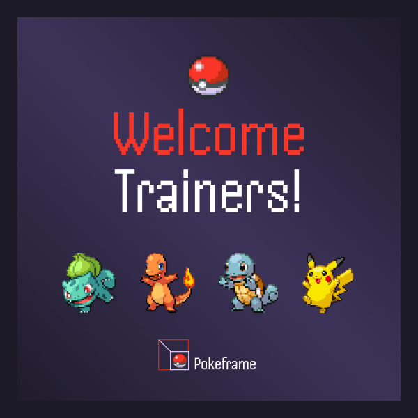
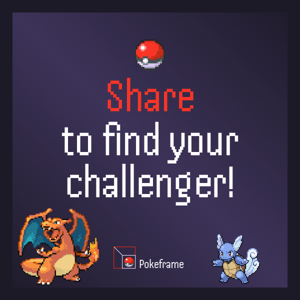
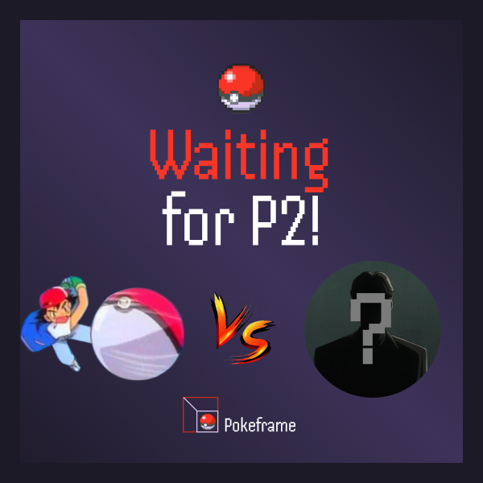

# cartesi-hackathon-ita-2024
# PokeFrames

Welcome to PokeFrames, a Pokémon Battle Simulation Game! This project is a blockchain-based game built using **Farcaster Frames** and **Cartesi**. Players can mint their Pokémon and engage in battles against other players, leveraging blockchain technology to ensure a secure and verifiable gaming experience.

## Introduction

The Pokémon Battle Simulation Game combines the nostalgic fun of Pokémon battles with the innovative technology of blockchain. Players can mint their unique Pokémon NFTs and battle against other players in a secure and verifiable environment, thanks to the power of Cartesi and Farcaster Frames.

## Features

- **Mint Pokémon NFTs**: Players can mint their own Pokémon as unique NFTs.
- **Battle Other Players**: Engage in turn-based battles with other players.
- **Secure and Verifiable**: Leveraging Cartesi, all battle data and player transactions are securely stored on the blockchain.
- **Battle Logs**: Battle logs are stored on the blockchain, providing a transparent and tamper-proof record of all battles.

## How It Works

The game is built on the Cartesi framework, a layer-2 solution for blockchain applications, which provides a secure and decentralized environment for the game mechanics. Here's a high-level overview of how the game works:

1. **Minting Pokémon**: Players can mint their Pokémon using the Farcaster Frames interface, creating unique NFTs representing their Pokémon.
2. **Initiating a Battle**: Players can challenge each other to battles. Each player's moves and strategies are executed in a turn-based format.
3. **Using Cartesi**: The game leverages Cartesi's infrastructure to store battle logs and secure each player's turn transactions. This ensures that the game remains fair and that all actions are verifiable.
4. **Battle Logs**: All battle logs are stored on the blockchain, ensuring transparency and preventing tampering with battle outcomes.

### Prerequisites

- [Node.js](https://nodejs.org/)
- [Cartesi](https://docs.cartesi.io/cartesi-rollups/1.5/)
- [Farcaster Frames](https://farcaster.xyz/)
- [SQLite](https://www.sqlite.org/)

## Media and Photos

Check out the following links to see the game in action and explore its features:

- **[Demo Video](https://example.com/demo-video-link)**: Watch a demo video of the game showcasing minting, battling, and blockchain integration.
- **[GitHub Backend Repository](https://github.com/lucas-fochesatto/pokemon-backend)**: Access the source code and contribute to the project.
- **Screenshots**: Below are some screenshots of our application:

  
  
  

